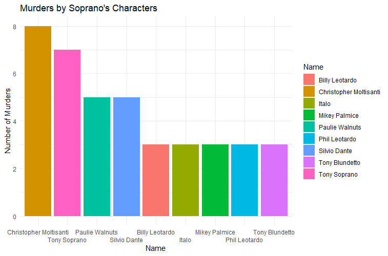
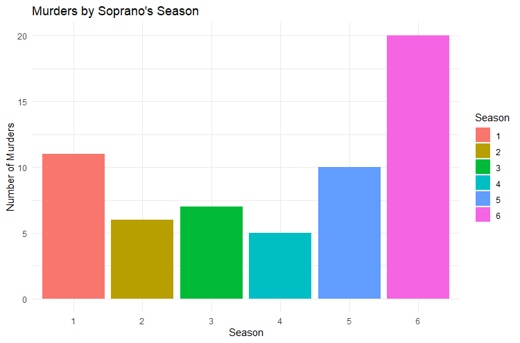
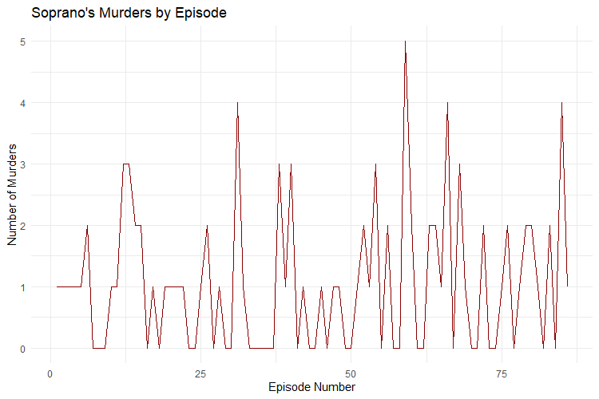
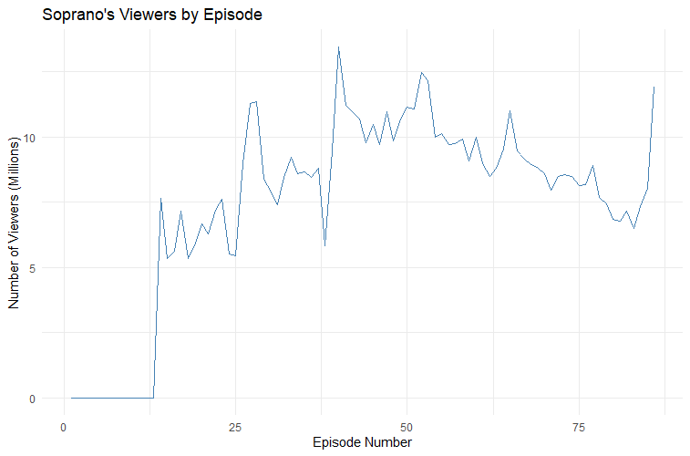
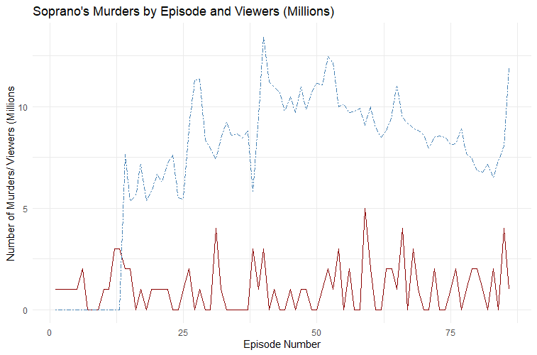
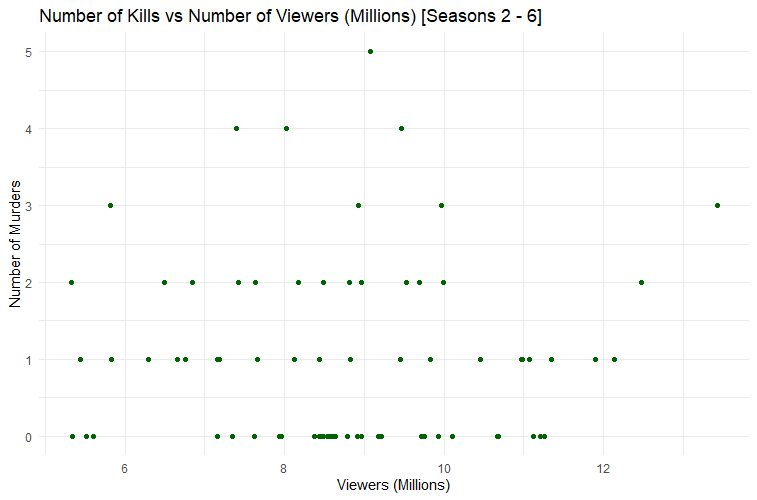

# Does Violence in the Soprano's Lead to More Viewers?

The short answer: no.    (& of course spoiler warning for the show.)

### Violence in the Show

The Soprano’s is a show about life and death and sometimes there seems to be a lot of the latter. Overall, there are 93 [deaths in the Soprano’s](https://sopranos.fandom.com/wiki/List_of_deaths) that are either shown or discussed. Of those deaths, 59 are murders. For the purposes of this analysis, I only included murders where we know who committed the murder.  

### Who Shot Who?

Most of the shooting in the show comes from main characters as seen here. 

 

For me this stands to reason that characters like Tony and Chris would do the most shooting. They occupy the most screen time and are the center of most of the story. If this were the say "The Dante's" rather than the Soprano's, we might expect Silvio to have more action. Two interesting characters for me are Mikey Palmice and Tony Blundetto. For characters who only appear in one season both have a lot of action.

While this analysis has shown that many murders are committed by main characters it has not directly answered if violence leads to greater viewership.

### When Did the Shooting Happen?

Knowing when the violence occurs allows us to see if there is any correlation with viewership numbers. Here is the number of murders by season (remember, I'm only showing murders here not all deaths, so non-murder related deaths (Livia Soprano for example) are not included here).


*Side note, Season six is longer than the other seasons, so keep that in mind

Overall, we see that there is a reasonable disparity in the violence. Season four has the fewest murders with 5 and Season six has the most with 20. Anecdotally, Season four probably has the fewest because it ends with the collapse of Tony and Carmella's marriage rather than a violent confrontation like Season one or Season six.

In this next plot we can see the deaths overtime based on each episode.



The general pattern shows that there is a murder about every other episode with large spikes near the end of seasons.

Next, we will look at the number of viewers for each episode. Based on the data I pulled from [wikipedia](https://en.wikipedia.org/wiki/List_of_The_Sopranos_episodes), I could not get information on the viewership from the first season.



Viewership follows an interesting pattern. For the first 4 seasons viewership increases until it hits the finale of Season four with a high of 13.43 million viewers for the episode "For All Debts Public and Private". After this peak, the viewership decreases until the final episode of the show where it increases to 11.9 million viewers for the series finale "Made in America". 

Next, I will overlay the murders and the viewership numbers to see if there is any obvious correlation.



Notice how the viewership pattern follows an arc shape and the murders stay much more consistent.

### Let’s Do Some Math

In an effort to a do a more rigorous test of whether murder and viewership are correlated lets calculate the [Pearson's Correlation](https://www.youtube.com/watch?v=e4ApDqG6MGE). As a brief review, the Pearson Correlation tells us the direction and the strength of two different variables. For a more detailed explanation of Pearson correlation please check out this [link](https://www.investopedia.com/terms/c/correlation.asp). For our purposes, it’s important to know that correlation can vary between -1 and 1 with 0 meaning there is no correlation. The correlation between murders and viewership on the Soprano's is -0.006906039 which means that it basically doesn't exist (p-value = 0.9538).

Here is a graph that charts the number of viewers per episode vs the number of murders for each episode.


*I omitted Season one because I couldn't get ahold of the data

Notice, that even in the chart you would be hard pressed to find some sort of pattern.

### Conclusion

While the violence in the show may be a driving factor for some of the audience, overall, it does not appear to be a significant force in its contemporary viewership. It would be interesting to do a follow up study if more information about current viewership (IE: data from streaming services like Amazon, HBO Max etc.) became available.


### R code for Nerds

I will also include the excel document with all the data in the GitHub repository. 

```markdown
### Sopranos visuals
setwd("~/NC State")
library(tidyverse)
library(readxl)
library(RColorBrewer)

# read in data
df <- read_excel("sopranos.xlsx", 7)
views <- read_excel("sopranos.xlsx", 9)

# data cleaning
temp <- table(df$Killer1) %>% as.data.frame()
temp1 <- table(df$Killer2) %>% as.data.frame()
tk <- merge(temp, temp1, by = "Var1", all = TRUE)
tk[is.na(tk)] <- 0
tk$total <- tk$Freq.x + tk$Freq.y
# 3 people actually killed big pussy so Paulie needs to get credit for it which is given here
tk$total[tk$Var1 == "Paulie Walnuts"] <- tk$total[tk$Var1 == "Paulie Walnuts"] + 1
names(tk) <- c("Name", "Killer1", "Killer2", "Kills")
rm(temp, temp1)

# Murders by character
tk %>%
  arrange(desc(Kills)) %>%
  filter(Kills > 2) %>% 
  ggplot( aes(x = reorder(Name, -Kills), y = Kills, fill = as.factor(Name))) + 
  geom_bar(stat = "summary", fun = "mean" ) +
  ggtitle("Murders by Soprano's Characters") +
  labs(x="Name", y="Number of Murders", fill = "Name") +
  scale_x_discrete(guide = guide_axis(n.dodge=2)) +
  theme_minimal() 
  
# Murders by Season
df %>%
  filter(Murdered == "Y") %>% 
  group_by(Season) %>% 
  summarise(Kills = length(Season)) %>% 
  mutate(Season = as.factor(Season)) %>% 
  mutate(Kills = as.numeric(Kills)) %>% 
  ggplot( aes(x = Season, y = Kills, fill = as.factor(Season))) + 
  geom_bar(stat = "summary", fun = "mean" ) +
  ggtitle("Murders by Soprano's Season") +
  labs(x="Season", y="Number of Murders", fill = "Season") +
  theme_minimal()   

# data cleaning
temp <- df %>%
  group_by(Episode) %>% 
  summarize(num_kills = length(Season))

views <- merge(views, temp, by = "Episode", all.x = TRUE)
rm(temp) 
views %>% 
  mutate(Episode_num = as.factor(Episode_num))
views$num_kills[is.na(views$num_kills)] <- 0

# Murders by episode
views %>% 
  ggplot(aes(x = Episode_num, y = num_kills)) +
  geom_line(color = "darkred") +
  ggtitle("Soprano's Murders by Episode") +
  labs(x="Episode Number", y="Number of Murders") +
  theme_minimal() 
  
# Views by episode
views %>% 
  ggplot(aes(x = Episode_num, y = Viewers)) +
  geom_line(color = "steelblue") +
  ggtitle("Soprano's Viewers by Episode") +
  labs(x="Episode Number", y="Number of Viewers (Millions)") +
  theme_minimal() 

# Murders and Views by episode
ggplot(views, aes(x=Episode_num)) + 
  geom_line(aes(y = num_kills), color = "darkred") + 
  geom_line(aes(y = Viewers), color="steelblue", linetype="twodash") + 
  ggtitle("Soprano's Murders by Episode and Viewers (Millions)") +
  labs(x="Episode Number", y="Number of Murders/ Viewers (Millions") +
  theme_minimal() 

# correlation of viewers and murders removing the first season
temp <- views %>% filter(Season != 1)
temp %>% 
  ggplot(aes(x = Viewers, y = num_kills)) +
  geom_point(color = "darkgreen") + 
  ggtitle("Number of Kills vs Number of Viewers (Millions) [Seasons 2 - 6]") +
  labs(x="Viewers (Millions)", y="Number of Murders") +
  theme_minimal() 
cor(temp$Viewers, temp$num_kills)
cor.test(temp$Viewers, temp$num_kills)
rm(temp)
  # There is no correlation between murders and viewers
```
